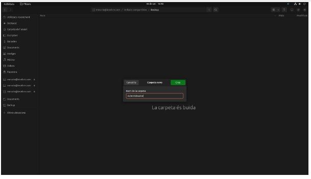

# Cas pràctic 1

SMX-B MP08

####  Alumnes
* Marc Muria 
* Corneliu Miron

#### Professor
* Javier Sancho 

# Índex

##### Per què és una bona solució?	
##### Pressupost mensual i anual	
##### Creació de les unitats compartides	
* BACKUP	
* DOCUMENTS	
##### Instal·lació d’adreces	
* Administrador/a	
* Usuari/a	
##### Exemples d’ús de fer un backup per part de l’administrador/a.	
##### Exemples d’ús de consultar un document per part de l’usuari/a.	
##### Comproveu si un usuari/a pot eliminar sense voler algun document.

# Per què és una bona solució?
Creiem que és una bona solució perquè si passés algun altre imprevist, com per exemple infeccions del sistema per virus o programari maliciós (malware), problemes del maquinari, com ara una avaria del disc dur, apagament incorrecte de l’ordinador o problemes relacionats amb algun programa concret i també esborrat d’arxius per error. Ens serviria per a fer una o varies còpies de seguretat gràcies a la qual tota la nostra informació es pot salvar davant qualsevol conflicte. 
A part del tema còpies de seguretat, tenim ens ofereix més avantatges com ara un emmagatzematge de com a màxim 2TB per un preu molt baix, i si arribés a fer falta, podem augmentar el nostre pla. 
Si tenim cap problema o dubte, podem trucar a un expert de Google el qual ens proporcionarà l’ajuda necessària per a poder solucionar el que necessitem. 
Podem compartir qualsevol tipus d’arxiu amb un màxim de 5 usuaris. 
Ens ofereix en Google Workspace Premium videotrucades en grup Meet de fins a 24h; Videotrucades en directe a YouTube; Cancel·lació de soroll per a Meet.
També podem enregistrar videotrucades de Meet i tenim una VPN per a Android i iOS.

# Pressupost mensual i anual

# Creació de les unitats compartides

## BACKUP
1. El primer pas serà clicar a nou.
 > 
2. Seguidament escriurem el nom.
> 
3. A continuació triar els membres. 
> 
4. I per finalitzar, escollim els permisos que asignarem al membre. 
> 

## DOCUMENTS
1. El primer pas serà clicar a nou.
 > 
2. Seguidament escriurem el nom.
> 
3. A continuació triar els membres. 
> 
4. I per finalitzar, escollim els permisos que asignarem al membre. 
> 

# Instal·lació d’adreces

## Administrador/a
1. El primer pas sira afegi una cuenta en google en el vostre sistema operatiu linux.
> 
3. El següent pas sira entra a on esta la cuenta creada anteriormente.
> 
5. A continuació sira entra en la carpeta de (La meva unitat).
> 
7. Ara tindrem que crear una carpeta.
> 
9. I per finalitza arastrarem la carpeta creada al conte creat.
> 
11. I ja u tindriem.
> 

## Usuari/a
> 

# Exemples d’ús de fer un backup per part de l’administrador/a.
> 

# Exemples d’ús de consultar un document per part de l’usuari/a.
> 

# Comproveu si un usuari/a pot eliminar sense voler algun document.
> 
